<!--
╔══════════════════════════════════════════════════════════════════════════════╗
║    SASWAT MOHANTY  ·  GITHUB PROFILE  ·  v5.0 "CYBERNETIC ULTRAVIOLET"       ║
║    → Real-Time Telemetry · Interactive ASCII Avatar · Milestone Trophies     ║
║    → 60 FPS Motion · Multi-Agent AI · Silky UX Systems                       ║
╚══════════════════════════════════════════════════════════════════════════════╝
-->

<!-- ╭──────── TOP TELEMETRY BEACONS ────────╮ -->
<div align="right">
  
  
  
</div>

<div align="center">

<!-- ╭──────── MATRIX BOOT SEQUENCE ────────╮ -->


</div>

<!-- ╭──────── AURORA VENOM HERO ────────╮ -->


<div align="center">

<br/>

<!-- ╭──────── TYPING ANIMATION ────────╮ -->
<a href="https://github.com/SazWhatician">
  
</a>

<br/><br/>

<!-- ╭──────── STATUS BEACONS ────────╮ -->


<br/><br/>

<!-- ╭──────── CONNECT QUICK-BAR ────────╮ -->
<a href="https://www.linkedin.com/in/saswat-mohanty-0a4549331/">
  
</a>
<a href="mailto:saswatmohanty029@gmail.com">
  
</a>
<a href="https://github.com/SazWhatician">
  
</a>
<a href="https://x.com/">
  
</a>
<a href="https://discord.com/">
  
</a>

</div>


<br/>

<!-- ═══════════════════════════════════════════════════════════════════ -->
<!-- CHECKPOINT 01 · BATTLE TELEMETRY & COMMIT STATS                     -->
<!-- ═══════════════════════════════════════════════════════════════════ -->

##  🚩 `CHECKPOINT 01` · Battle Telemetry & Commit Stats `// > git log --telemetry`

<div align="center">

<!-- LIVE CONTRIBUTION WAVEFORM -->


<br/><br/>

<!-- PRIMARY COMMIT STATS & STREAK -->


<br/><br/>

<!-- LANGUAGES & PROFILE SUMMARY -->


<br/><br/>

<!-- DEEP DIVE ANALYTICS -->


</div>


<br/>

<!-- ═══════════════════════════════════════════════════════════════════ -->
<!-- CHECKPOINT 02 · TROPHY VAULT & CHECKPOINT ACHIEVEMENTS              -->
<!-- ═══════════════════════════════════════════════════════════════════ -->

##  🏆 `CHECKPOINT 02` · Trophy Vault & Checkpoint Badges `// > ls trophies/ --gold-first`

<div align="center">


<br/><br/>


</div>


<br/>

<!-- ═══════════════════════════════════════════════════════════════════ -->
<!-- CHECKPOINT 03 · IDENTITY MATRIX & INTERACTIVE ASCII AVATAR          -->
<!-- ═══════════════════════════════════════════════════════════════════ -->

##  👾 `CHECKPOINT 03` · Identity Matrix & Bio-Dossier `// > whoami`

<table>
<tr>
<td width="42%" align="center" valign="middle">

<!-- INTERACTIVE HOVER ANIMATED ASCII AVATAR -->
<a href="https://github.com/SazWhatician">
  
</a>

<br/>
<sub><i>👆 <b>Hover over the Bio-Avatar</b> to activate laser scanline &amp; matrix shift</i></sub>
<br/><br/>


</td>
<td width="58%" valign="top">

```typescript
const saswat: AIEngineer = {
  role:       "AI Engineer × Agentic Architect",
  pronouns:   "he / him",
  location:   "🇮🇳 India  //  IST · UTC+5:30",

  building: [
    "native SSE chatbots",
    "LangGraph multi-agent orchestration",
    "React micro-interactions (GSAP + Framer)",
  ],

  ai_stack: [
    "LangGraph", "LangChain", "Claude API",
    "Gemini API", "Vercel AI SDK", "Pinecone",
  ],

  app_stack: [
    "Python", "TypeScript", "React", "Next.js",
    "FastAPI", "Node.js", "PostgreSQL", "Redis",
  ],

  passion:    ["autonomous agents", "silky UX", "clean systems"],
  philosophy: "KISS · YAGNI · ship it clean, ship it fast",
  ask_me:     ["multi-agent AI", "SSE streaming", "GSAP timelines"],
  learning:   ["MLOps at scale", "distributed systems"],
  fun_fact:   "I dream in state machines. 🤖",
};
```

<br/>

<!-- SKILL METERS -->
<table>
<tr><td><sub>AI Engineering</sub></td><td></td></tr>
<tr><td><sub>Full-Stack Dev</sub></td><td></td></tr>
<tr><td><sub>UI / UX + Motion</sub></td><td></td></tr>
<tr><td><sub>DevOps / MLOps</sub></td><td></td></tr>
</table>

</td>
</tr>
</table>


<br/>

<!-- ═══════════════════════════════════════════════════════════════════ -->
<!-- CHECKPOINT 04 · ARSENAL & TECH STACK RADAR                          -->
<!-- ═══════════════════════════════════════════════════════════════════ -->

##  ⚡ `CHECKPOINT 04` · Arsenal & Tech Stack Radar `// > cat stack.json`

<div align="center">

<table>
<tr>
<td valign="top" width="50%">

#### 


#### 


<br/>


#### 


#### 


</td>
<td valign="top" width="50%">

#### 


<br/>


#### 


#### 


#### 


</td>
</tr>
</table>

</div>


<br/>

<!-- ═══════════════════════════════════════════════════════════════════ -->
<!-- CHECKPOINT 05 · ACTIVE QUESTS & MISSIONS                            -->
<!-- ═══════════════════════════════════════════════════════════════════ -->

##  🎯 `CHECKPOINT 05` · Active Quests & Missions `// > ls missions/`

<table>
<tr>
<td width="33%" align="center" valign="top">


<br/><br/>

**HRMS Native SSE Chatbot**

<sub>Multi-agent orchestration with LangGraph + Gemini.<br/>Real-time server-sent events streamed to React frontend.</sub>

<br/>


</td>
<td width="33%" align="center" valign="top">


<br/><br/>

**Distributed AI Systems**

<sub>Vector DBs, event streams,<br/>observability &amp; tracing for<br/>agent fleets in production.</sub>

<br/>


</td>
<td width="33%" align="center" valign="top">


<br/><br/>

**Open-Source Agent Tooling**

<sub>Autonomous agent runtimes,<br/>eval harnesses &amp; browser automation<br/>from demo to production.</sub>

<br/>


</td>
</tr>
</table>


<br/>

<!-- ═══════════════════════════════════════════════════════════════════ -->
<!-- CHECKPOINT 06 · CONTRIBUTION GRID RUNNER                           -->
<!-- ═══════════════════════════════════════════════════════════════════ -->

##  🐍 `CHECKPOINT 06` · Contribution Grid Snake Runner `// > git diff --snake-eater`

<div align="center">
  <picture>
    <source media="(prefers-color-scheme: dark)"  srcset="https://raw.githubusercontent.com/SazWhatician/SazWhatician/output/github-contribution-grid-snake-dark.svg"/>
    <source media="(prefers-color-scheme: light)" srcset="https://raw.githubusercontent.com/SazWhatician/SazWhatician/output/github-contribution-grid-snake.svg"/>
    
  </picture>
</div>


<br/>

<!-- ═══════════════════════════════════════════════════════════════════ -->
<!-- CHECKPOINT 07 · PINNED ARTIFACTS & REPOSITORIES                     -->
<!-- ═══════════════════════════════════════════════════════════════════ -->

##  📦 `CHECKPOINT 07` · Pinned Artifacts & Repositories `// > ls projects/ --pinned`

<div align="center">

<a href="https://github.com/SazWhatician/HRMSXYZ">
  
</a>
<a href="https://github.com/SazWhatician/PNEUFINAL">
  
</a>

<br/><br/>

<a href="https://github.com/SazWhatician/ProjectML">
  
</a>
<a href="https://github.com/SazWhatician/SazWhatician">
  
</a>

</div>


<br/>

<!-- ═══════════════════════════════════════════════════════════════════ -->
<!-- CHECKPOINT 08 · COMPETITIVE ARENA & CODING TELEMETRY                -->
<!-- ═══════════════════════════════════════════════════════════════════ -->

<details open>
<summary><h2 style="display:inline">⚔️ &nbsp;<code>CHECKPOINT 08</code> · Competitive Arena &amp; Code Heatmap &nbsp;<code>// > ./competitive --expand</code></h2></summary>

<br/>

<div align="center">


<br/><br/>


</div>

</details>

<br/>

<!-- ═══════════════════════════════════════════════════════════════════ -->
<!-- CHECKPOINT 09 · MATRIX DEV WISDOM                                   -->
<!-- ═══════════════════════════════════════════════════════════════════ -->

##  🔮 `CHECKPOINT 09` · Matrix Dev Wisdom `// > fortune | cowsay`

<div align="center">
  
</div>

<br/>

<!-- ═══════════════════════════════════════════════════════════════════ -->
<!-- CHECKPOINT 10 · COMM LINK & NEURAL CONNECT                          -->
<!-- ═══════════════════════════════════════════════════════════════════ -->

##  📡 `CHECKPOINT 10` · Comm Link & Neural Connect `// > ping --all`

<div align="center">

<table>
<tr>
<td align="center" width="20%">
<a href="https://www.linkedin.com/in/saswat-mohanty-0a4549331/">
  
  <br/><sub><b>LinkedIn</b></sub>
</a>
</td>
<td align="center" width="20%">
<a href="mailto:saswatmohanty029@gmail.com">
  
  <br/><sub><b>Email</b></sub>
</a>
</td>
<td align="center" width="20%">
<a href="https://github.com/SazWhatician">
  
  <br/><sub><b>GitHub</b></sub>
</a>
</td>
<td align="center" width="20%">
<a href="https://x.com/">
  
  <br/><sub><b>X / Twitter</b></sub>
</a>
</td>
<td align="center" width="20%">
<a href="https://discord.com/">
  
  <br/><sub><b>Discord</b></sub>
</a>
</td>
</tr>
</table>

<br/>

<a href="https://buymeacoffee.com/">
  
</a>
<a href="https://github.com/sponsors/SazWhatician">
  
</a>

</div>

<br/>

<!-- ╭──────── FOOTER WAVE ANIMATION ────────╮ -->


<div align="center">
  <sub>
    ⚡ Engineered with Cybernetic Motion &amp; AI by
    <a href="https://github.com/SazWhatician"><b>Saswat Mohanty</b></a>
    &nbsp;·&nbsp; <i>"Ship it clean. Ship it fast. Ship it now."</i>
  </sub>
</div>
