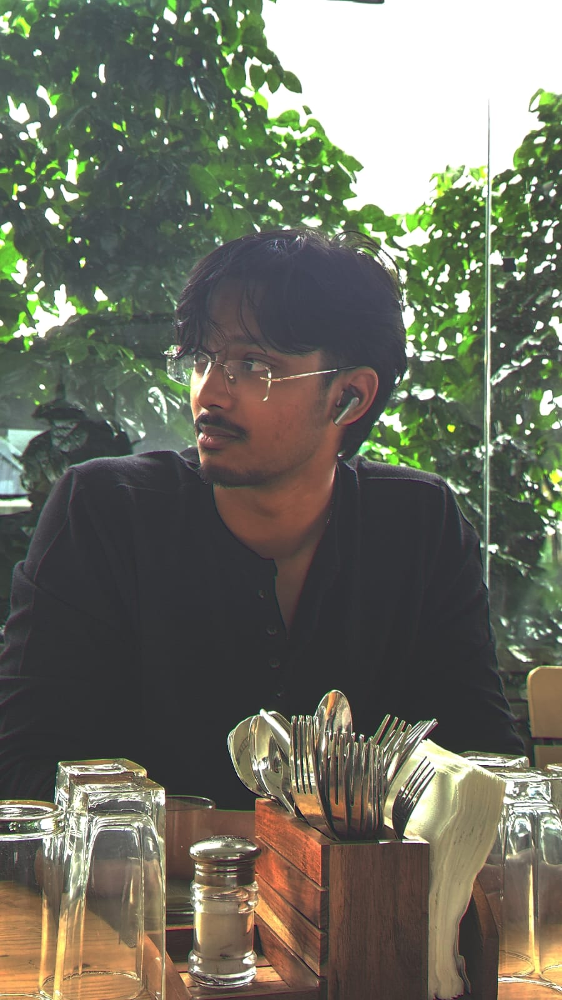

<!--
╔══════════════════════════════════════════════════════════════════════════════╗
║    SASWAT MOHANTY  ·  GITHUB PROFILE  ·  EDITION MMXXIV                      ║
║    → Custom SMIL-animated SVG cards. Curvy luxury serif. Warm beige & wine.  ║
║    → Systems that ship. Interfaces that breathe. Words that don't shout.     ║
╚══════════════════════════════════════════════════════════════════════════════╝
-->

<!-- ╭──────── TOP TELEMETRY BEACONS ────────╮ -->
<div align="right">
  
  
  
</div>

<!-- ═══════════════════════════════════════════════════════════════════════ -->
<!-- HERO · BESPOKE ANIMATED LUXURY BANNER (CURVY SERIF, BEIGE, OLIVE, BURGUNDY) -->
<!-- ═══════════════════════════════════════════════════════════════════════ -->

<p align="center">
  
</p>

<div align="center">

<!-- Serif italic tagline typing -->


<br/>

<!-- Small caps mono subheading -->
<a href="https://github.com/SazWhatician">
  
</a>

<br/><br/>

<!-- ╭──────── CONNECT QUICK-BAR ────────╮ -->
<a href="https://www.linkedin.com/in/saswat-mohanty-0a4549331/">
  
</a>
<a href="mailto:saswatmohanty029@gmail.com">
  
</a>
<a href="https://github.com/SazWhatician">
  
</a>
<a href="https://leetcode.com/u/Saswat144/">
  
</a>
<a href="https://x.com/">
  
</a>

</div>

<br/>

<!-- ═══════════════════════════════════════════════════════════════════ -->
<!-- 01 / TELEMETRY · LIVE ANIMATED REEL COUNTERS (ALL-TIME CONTRIBUTIONS & REPOS) -->
<!-- ═══════════════════════════════════════════════════════════════════ -->

## `01` · Telemetry

<p align="center">
  
</p>

<div align="center">

<!-- Analytics cards -->
<table>
<tr>
<td width="50%" align="center" valign="top">

</td>
<td width="50%" align="center" valign="top">

</td>
</tr>
</table>

<table>
<tr>
<td width="33%" align="center" valign="top">

</td>
<td width="33%" align="center" valign="top">

</td>
<td width="33%" align="center" valign="top">

</td>
</tr>
</table>

</div>

<br/>

<!-- ═══════════════════════════════════════════════════════════════════ -->
<!-- 02 / DOSSIER · IDENTITY & ARCHITECTURE SPECIFICATION               -->
<!-- ═══════════════════════════════════════════════════════════════════ -->

## `02` · Dossier

<table>
<tr>
<td width="36%" align="center" valign="middle">

<br/>

<a href="https://github.com/SazWhatician">
  
</a>

<br/><br/>


<br/><br/>


</td>
<td width="64%" valign="top">

```typescript
const saswat = {
  role:      "AI Engineer",
  pronouns:  "he / him",
  location:  "India · IST",

  building: [
    "Dr.Debug — a debugger that opens its own pull requests",
    "Polaris — a research canvas that reads like paper",
    "Polarassist — the copilot that stays quiet until asked",
  ],

  stack: {
    languages: ["TypeScript", "Python", "Javascript", "C++", "C"],
    frontend:  ["React", "Next.js", "GSAP", "Three.js"],
    backend:   ["FastAPI", "Node.js", "Postgres", "Redis"],
    models:    ["Claude", "Gemini", "OpenAI", "LangGraph"],
    
  },

  ethos: [
    "Small teams. Careful code. Long patience.",
    "Latency is language. Every millisecond speaks.",
    "Interfaces are trust — earn it in the details.",
    "Fewer features, better ones.",
  ],

  philosophy: "measure twice · ship once · then watch the logs",
  ask_me_about: ["debugging tools", "streaming interfaces", "motion craft"],
  fun_fact: "I ask for logs everytime something goes wrong.",
};
```

</td>
</tr>
</table>

<br/>

<!-- ═══════════════════════════════════════════════════════════════════ -->
<!-- 03 / INITIATIVES · ANIMATED FLAGSHIP SHOWCASE CARDS                 -->
<!-- ═══════════════════════════════════════════════════════════════════ -->

## `03` · Initiatives

<!-- Mission 01: Dr.Debug Animated Showcase Card -->
<p align="center">
  <a href="https://github.com/SazWhatician/Dr.Debug">
    
  </a>
</p>

<br/>

<!-- Mission 02: Polaris Animated Showcase Card -->
<p align="center">
  <a href="https://github.com/SazWhatician/Polaris">
    
  </a>
</p>

<br/>

<!-- Mission 03: MedScan AI Animated Showcase Card -->
<p align="center">
  <a href="https://github.com/SazWhatician/MedScan-AI">
    
  </a>
</p>

<br/>

<!-- ═══════════════════════════════════════════════════════════════════ -->
<!-- 04 / CHRONICLE · CONTRIBUTION GRID SNAKE RUNNER                     -->
<!-- ═══════════════════════════════════════════════════════════════════ -->

## `04` · Chronicle

<div align="center">
  <picture>
    <source media="(prefers-color-scheme: dark)"  srcset="https://raw.githubusercontent.com/SazWhatician/SazWhatician/output/github-contribution-grid-snake-dark.svg"/>
    <source media="(prefers-color-scheme: light)" srcset="https://raw.githubusercontent.com/SazWhatician/SazWhatician/output/github-contribution-grid-snake.svg"/>
    
  </picture>
</div>

<br/>

<!-- ═══════════════════════════════════════════════════════════════════ -->
<!-- 05 / ARCHIVE · FEATURED REPOSITORIES & FLAGSHIP BUILDS             -->
<!-- ═══════════════════════════════════════════════════════════════════ -->

## `05` · Archive

<div align="center">

<table>
<tr>
<td width="50%" valign="top">

### 🌌 [`Polaris`](https://github.com/SazWhatician/Polaris)
<sub>***a research canvas that reads like paper***</sub><br/>
<sub>Grounded answers with citations, quiet typography, and a chat that thinks before it speaks.</sub>

<br/><br/>

<a href="https://github.com/SazWhatician/Polaris">
  
  
  
  
</a>

</td>
<td width="50%" valign="top">

### 🔬 [`MedScan-AI`](https://github.com/SazWhatician/MedScan-AI)
<sub>***vision models for the clinic***</sub><br/>
<sub>Reading scans for lesions, mapping heat, second-opinion signal for doctors — a careful reader of pixels.</sub>

<br/><br/>

<a href="https://github.com/SazWhatician/MedScan-AI">
  
  
  
  
</a>

</td>
</tr>

<tr>
<td width="50%" valign="top">

### 🩺 [`Dr.Debug`](https://github.com/SazWhatician/Dr.Debug)
<sub>***the debugger that debugs itself***</sub><br/>
<sub>Traces the error, reads the codebase, writes the root cause, opens the pull request. Then sleeps.</sub>

<br/><br/>

<a href="https://github.com/SazWhatician/Dr.Debug">
  
  
  
  
</a>

</td>
<td width="50%" valign="top">

### 🛰️ [`Polarassist`](https://github.com/SazWhatician/Polarassist)
<sub>***the copilot that stays quiet***</sub><br/>
<sub>Context-aware, vector-grounded, opinionated. Waits for the question. Answers in one line if it can.</sub>

<br/><br/>

<a href="https://github.com/SazWhatician/Polarassist">
  
  
  
  
</a>

</td>
</tr>

<tr>
<td width="50%" valign="top">

### ⚡ [`ENIGMA-WEBSITE`](https://github.com/SazWhatician/ENIGMA-WEBSITE)
<sub>***a symposium as a moving painting***</sub><br/>
<sub>Choreographed transitions, careful typography, registration that feels like a good invitation card.</sub>

<br/><br/>

<a href="https://github.com/SazWhatician/ENIGMA-WEBSITE">
  
  
  
  
</a>

</td>
<td width="50%" valign="top">

### 🫁 [`PNUE-RECOG`](https://github.com/SazWhatician/PNUE-RECOG)
<sub>***a small model, a serious job***</sub><br/>
<sub>Classifies chest scans with feature-map explanations so the model earns its trust one image at a time.</sub>

<br/><br/>

<a href="https://github.com/SazWhatician/PNUE-RECOG">
  
  
  
  
</a>

</td>
</tr>
</table>

</div>

<br/>

<!-- ═══════════════════════════════════════════════════════════════════ -->
<!-- 06 / ARENA · COMPETITIVE ALGORITHMS                                -->
<!-- ═══════════════════════════════════════════════════════════════════ -->

<details open>
<summary><h2 style="display:inline"><code>06</code> · Arena</h2></summary>

<br/>

<div align="center">

<a href="https://leetcode.com/u/Saswat144/">
  
</a>

</div>

</details>

<br/>

<!-- ═══════════════════════════════════════════════════════════════════ -->
<!-- 07 / ETHOS · PHILOSOPHY & MANIFESTO                                -->
<!-- ═══════════════════════════════════════════════════════════════════ -->

## `07` · Ethos

<p align="center">
  
</p>

<br/>

<!-- ═══════════════════════════════════════════════════════════════════ -->
<!-- 08 / INQUIRIES · CHANNELS & SPONSORSHIP                            -->
<!-- ═══════════════════════════════════════════════════════════════════ -->

## `08` · Inquiries

<div align="center">

<table>
<tr>
<td align="center" width="20%">
<a href="https://www.linkedin.com/in/saswat-mohanty-0a4549331/">
  
  <br/><sub><b>LinkedIn</b></sub>
</a>
</td>
<td align="center" width="20%">
<a href="mailto:saswatmohanty029@gmail.com">
  
  <br/><sub><b>Email</b></sub>
</a>
</td>
<td align="center" width="20%">
<a href="https://github.com/SazWhatician">
  
  <br/><sub><b>GitHub</b></sub>
</a>
</td>
<td align="center" width="20%">
<a href="https://leetcode.com/u/Saswat144/">
  
  <br/><sub><b>LeetCode</b></sub>
</a>
</td>
<td align="center" width="20%">
<a href="https://x.com/">
  
  <br/><sub><b>X / Twitter</b></sub>
</a>
</td>
</tr>
</table>

<br/>

<a href="https://buymeacoffee.com/">
  
</a>
<a href="https://github.com/sponsors/SazWhatician">
  
</a>

</div>

<br/>

<!-- ╭──────── FOOTER SIGN-OFF ────────╮ -->
<div align="center">
  <sub>
    Designed in serif, shipped in mono, signed by
    <a href="https://github.com/SazWhatician"><b>Saswat Mohanty</b></a>
    &nbsp;·&nbsp; <i>measure twice · ship once · then watch the logs</i>
    <br/>
    <sup>edition mmxxiv · bespoke animated luxury cards · rendered live on github</sup>
  </sub>
</div>
